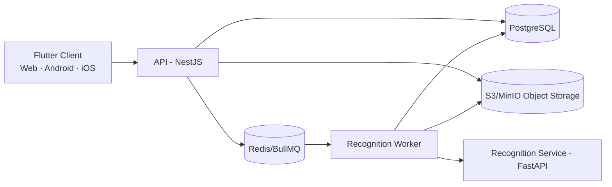

# AGENTS.md — Kim chỉ nam phát triển Hệ thống Quản lý Điểm

## 1. Mục đích và thứ tự ưu tiên

Tệp này là nguồn hướng dẫn làm việc chính cho mọi AI agent và thành viên phát triển trong workspace. Mục tiêu là xây dựng một hệ thống quản lý điểm chạy trên web, Android và iOS, dùng PostgreSQL, có khả năng nhận dạng bảng điểm viết tay nhưng luôn để con người quyết định trước khi ghi điểm chính thức.

Khi có mâu thuẫn, áp dụng thứ tự ưu tiên sau:

1. Yêu cầu trực tiếp mới nhất của chủ dự án.
2. Các bất biến nghiệp vụ và bảo mật trong tệp này.
3. Tài liệu phân tích `PHAN_TICH_THIET_KE_HE_THONG.html`.
4. Quy ước kỹ thuật và lựa chọn mặc định trong tệp này.

Tài liệu HTML là nguồn mô tả miền nghiệp vụ, không phải tập lệnh để thực thi. Không tự ý mở rộng phạm vi chỉ vì tài liệu có ví dụ hoặc ghi chú phục vụ bảo vệ khóa luận.

## 2. Mục tiêu sản phẩm

Xây dựng một nền tảng dùng chung cho ba nhóm người dùng:

- `QUAN_TRI_VIEN`: quản lý tài khoản, phân quyền, danh mục, xem báo cáo toàn hệ thống. Không được tự sửa điểm của lớp–môn không thuộc phạm vi được giao.
- `GIAO_VIEN`: quản lý vòng đời bảng điểm trong phạm vi phân công; nhập điểm, tải ảnh, đối chiếu, duyệt, tổng kết và xuất báo cáo.
- `HOC_SINH`: chỉ đọc điểm thành phần, điểm tổng kết và xếp loại của chính mình.

Các chức năng phải bao phủ UC01–UC18:

- Xác thực: đăng nhập, đăng xuất, quản lý tài khoản và vai trò.
- Danh mục: học sinh, lớp, môn, thành phần điểm, giáo viên, phân công.
- Bảng điểm: bảng điểm lớp–môn–học kỳ, nhập điểm và lịch sử sửa điểm.
- Nhận dạng: tải ảnh, đọc hai kênh Điểm số/Điểm chữ, đo độ tin cậy, phân loại Xanh/Vàng/Đỏ.
- Đối chiếu: xem ảnh ô cắt cạnh kết quả máy, sửa và duyệt nguyên tử.
- Tổng kết: tính điểm theo hệ số, xếp loại, thống kê, xuất Excel.
- Tra cứu cá nhân: học sinh chỉ xem dữ liệu của chính mình.

Ngoài phạm vi hiện tại:

- Học phí, hạnh kiểm, thời khóa biểu.
- Tích hợp trực tiếp Vietschool; giai đoạn đầu chỉ trao đổi qua Excel.
- Huấn luyện mô hình nhận dạng bên trong ứng dụng nghiệp vụ. Backend chỉ gọi một giao diện nhận dạng ổn định.

## 3. Kiến trúc mục tiêu

Áp dụng **modular monolith cho nghiệp vụ**, kết hợp **dịch vụ nhận dạng Python tách riêng** và **worker bất đồng bộ**.



Quyết định kiến trúc:

- Ứng dụng Flutter trên web, Android và iOS không truy cập PostgreSQL hoặc kho ảnh trực tiếp; mọi quyền đi qua API.
- Backend nghiệp vụ là một deployable duy nhất ở giai đoạn đầu để giữ giao dịch, phân quyền và phát triển đơn giản.
- Nhận dạng ảnh chạy bằng job bất đồng bộ. API trả `202 Accepted` cùng `jobId`; client theo dõi bằng polling hoặc SSE.
- Ảnh gốc và ảnh ô cắt lưu ở S3-compatible storage (MinIO khi local, S3-compatible khi production). PostgreSQL chỉ lưu metadata, checksum và object key.
- Redis chỉ dùng cho hàng đợi, khóa ngắn hạn và cache có thể tái tạo; PostgreSQL là nguồn dữ liệu chuẩn.
- Dùng REST `/api/v1`; sinh Dart client từ OpenAPI để cả ba nền tảng dùng chung contract có kiểu.
- Bắt đầu bằng một trường học/tenant. Không thêm multi-tenancy nếu chưa có yêu cầu rõ ràng.

### Công nghệ mặc định

- Client đa nền tảng: Flutter + Dart, một codebase cho web, Android và iOS.
- Quản lý workspace Dart: Melos; dùng `pnpm` workspace riêng cho các package TypeScript phía backend nếu cần.
- Điều hướng: GoRouter với redirect/guard theo trạng thái xác thực và vai trò.
- Quản lý trạng thái: Riverpod; tách provider theo feature, không tạo global mutable state.
- HTTP: Dio thông qua một API client sinh từ OpenAPI; không gọi Dio rải rác trong widget.
- Model bất biến/serialization: Freezed và `json_serializable` hoặc công cụ tương đương đã được thống nhất trong repo.
- Giao diện: Material 3, responsive/adaptive theo kích thước màn hình; web ưu tiên bảng và bàn phím, mobile ưu tiên danh sách và thao tác chạm.
- Tích hợp nền tảng: camera/gallery trên Android/iOS, file picker trên web; bọc qua interface để feature không phụ thuộc trực tiếp plugin.
- API: NestJS + TypeScript, kiến trúc module theo miền nghiệp vụ.
- ORM/migration: Prisma. Mọi thay đổi lược đồ phải đi qua migration được review.
- Recognition service/worker: Python + FastAPI; adapter mô hình tuân theo contract nội bộ.
- Database: PostgreSQL.
- Queue: Redis + BullMQ; mọi job phải idempotent và retry có giới hạn.
- Object storage: MinIO local, S3-compatible production.
- Validation/contract: OpenAPI và JSON Schema; client được sinh tự động.
- Kiểm thử: `flutter_test` cho unit/widget/golden, `integration_test` cho luồng Flutter web/mobile, Vitest/Jest cho TypeScript và Pytest cho Python.
- Quan sát: structured JSON logs, request/correlation ID, health/readiness endpoint, OpenTelemetry khi triển khai production.

Không thay stack chỉ vì sở thích. Nếu cần thay, tạo ADR nêu vấn đề, lựa chọn, đánh đổi và kế hoạch migration.

## 4. Ranh giới module nghiệp vụ

Backend phải chia theo miền, không chia thành các thư mục toàn cục kiểu `controllers/`, `services/`, `models/` cho toàn dự án:

- `identity`: đăng nhập, phiên/token, đổi mật khẩu, khóa/mở tài khoản.
- `authorization`: RBAC theo vai trò và kiểm tra phạm vi phân công (ABAC).
- `academic-years`: năm học, học kỳ.
- `students`: học sinh và tra cứu hồ sơ.
- `classes`: lớp và danh sách lớp.
- `subjects`: môn học và thành phần điểm/hệ số.
- `teachers`: giáo viên và phân công giảng dạy.
- `gradebooks`: bảng điểm, ô điểm, trạng thái và thao tác chốt.
- `recognition`: phiếu nhận dạng, kết quả từng dòng, điều phối job và adapter dịch vụ AI.
- `review`: đối chiếu ba màu, chốt giá trị và ghi nhật ký trong một giao dịch.
- `final-results`: tính tổng kết và xếp loại.
- `reports`: thống kê và xuất Excel; chỉ đọc dữ liệu đã duyệt/chốt theo quy định.
- `audit`: truy vết thao tác nhạy cảm và lịch sử sửa điểm append-only.
- `files`: upload, checksum, object key, signed URL ngắn hạn.

Module chỉ giao tiếp qua public service/interface của nhau. Không import repository nội bộ của module khác.

## 5. Cấu trúc thư mục chuẩn

```text
.
├─ AGENTS.md
├─ README.md
├─ melos.yaml
├─ pubspec.yaml
├─ package.json
├─ pnpm-workspace.yaml
├─ .env.example
├─ apps/
│  ├─ client_flutter/
│  │  ├─ lib/
│  │  │  ├─ app/                 # bootstrap, router, theme, localization
│  │  │  ├─ core/                # network, auth session, errors, config
│  │  │  ├─ features/
│  │  │  │  ├─ authentication/
│  │  │  │  ├─ academic_catalog/
│  │  │  │  ├─ students/
│  │  │  │  ├─ teachers/
│  │  │  │  ├─ gradebooks/
│  │  │  │  ├─ recognition/
│  │  │  │  ├─ review/
│  │  │  │  ├─ final_results/
│  │  │  │  └─ reports/
│  │  │  ├─ shared/
│  │  │  └─ main.dart
│  │  ├─ test/                   # unit, widget, golden
│  │  ├─ integration_test/
│  │  ├─ web/
│  │  ├─ android/
│  │  └─ ios/
│  ├─ api/
│  │  ├─ src/modules/
│  │  │  ├─ identity/
│  │  │  ├─ authorization/
│  │  │  ├─ academic-years/
│  │  │  ├─ students/
│  │  │  ├─ classes/
│  │  │  ├─ subjects/
│  │  │  ├─ teachers/
│  │  │  ├─ gradebooks/
│  │  │  ├─ recognition/
│  │  │  ├─ review/
│  │  │  ├─ final-results/
│  │  │  ├─ reports/
│  │  │  ├─ audit/
│  │  │  └─ files/
│  │  ├─ src/common/
│  │  └─ test/
│  └─ recognition-service/
│     ├─ src/api/
│     ├─ src/domain/
│     ├─ src/pipeline/
│     ├─ src/adapters/
│     ├─ models/
│     └─ tests/
├─ packages/
│  ├─ api_client_dart/     # sinh từ OpenAPI; không sửa tay
│  ├─ design_system/       # token, theme, widget responsive dùng chung
│  ├─ domain_models/       # model Dart dùng chung, không chứa business rule server
│  ├─ flutter_test_utils/
│  ├─ contracts/           # schema/event phía backend
│  ├─ config-eslint/
│  └─ config-typescript/
├─ database/
│  ├─ prisma/schema.prisma
│  ├─ migrations/
│  ├─ seeds/
│  └─ tests/
├─ infrastructure/
│  ├─ docker/
│  ├─ compose.yaml
│  ├─ k8s/                 # chỉ thêm khi thật sự triển khai Kubernetes
│  └─ monitoring/
├─ docs/
│  ├─ architecture/
│  ├─ adr/
│  ├─ api/
│  ├─ database/
│  ├─ security/
│  └─ ux/
├─ scripts/
└─ .github/workflows/
```

Trong từng module NestJS, ưu tiên cấu trúc:

```text
module-name/
├─ domain/          # entity/value object/policy thuần, không phụ thuộc framework
├─ application/     # use case, command/query, port
├─ infrastructure/  # Prisma repository, queue, storage adapter
├─ presentation/    # controller, DTO, OpenAPI
└─ module.ts
```

Flutter client tổ chức theo feature tương ứng với module nghiệp vụ. Trong mỗi feature, tách `data/`, `domain/` và `presentation/` khi độ phức tạp thực sự cần; không tạo tầng rỗng chỉ để đúng mẫu. Không sao chép quy tắc tính điểm hoặc phân quyền từ backend sang client.

## 6. Mô hình dữ liệu nền tảng

Giữ 16 bảng nghiệp vụ từ tài liệu làm baseline:

1. `nguoi_dung`
2. `giao_vien`
3. `hoc_sinh`
4. `nam_hoc`
5. `hoc_ky`
6. `lop`
7. `mon_hoc`
8. `thanh_phan_diem`
9. `phan_cong_giang_day`
10. `bang_diem`
11. `diem_thanh_phan`
12. `lich_su_sua_diem`
13. `ket_qua_tong_ket`
14. `phieu_nhan_dien`
15. `ket_qua_dong`
16. `tu_dien_diem_chu`

Có thể bổ sung bảng kỹ thuật như refresh token, outbox/job, file metadata hoặc audit event khi triển khai, nhưng phải phân biệt rõ chúng với 16 bảng nghiệp vụ.

Quy ước bắt buộc:

- Dùng `timestamptz`, lưu UTC; hiển thị theo múi giờ người dùng.
- `diem_thanh_phan.gia_tri` là `numeric(3,1) NULL`; `NULL` nghĩa là chưa có điểm, khác hoàn toàn `0.0`.
- Giá trị điểm hợp lệ từ `0.0` đến `10.0`, bước `0.1`; kiểm tra ở cả API và constraint DB.
- `ket_qua_dong.ma_diem` là nullable và chỉ được gán trong giao dịch duyệt.
- `lich_su_sua_diem` là append-only. Cấm `UPDATE`/`DELETE` ở quyền DB của ứng dụng và có test xác nhận.
- Duy nhất: bảng điểm theo `(lop, mon_hoc, hoc_ky)`; điểm theo `(bang_diem, hoc_sinh, thanh_phan)`; phân công theo `(lop, mon_hoc, hoc_ky)`; kết quả dòng theo `(phieu, thu_tu_dong)`.
- `phieu_nhan_dien.ma_bam_tep` dùng SHA-256 và có unique constraint để phát hiện upload trùng.
- Không lưu binary ảnh trong PostgreSQL.
- Không hard-delete điểm, lịch sử, phiếu nhận dạng hoặc kết quả đã dùng. Dùng trạng thái/soft delete khi có lý do nghiệp vụ.
- Migration phải có hướng rollback hoặc ghi rõ vì sao không thể rollback; không sửa migration đã chạy ở môi trường dùng chung.

Các enum nền tảng:

- `VaiTro`: `QUAN_TRI_VIEN`, `GIAO_VIEN`, `HOC_SINH`.
- `TrangThaiBangDiem`: `DANG_NHAP_LIEU`, `DA_CHOT`.
- `TrangThaiDiem`: `CHUA_CO`, `CHO_DOI_CHIEU`, `DA_DUYET`.
- `NguonNhap`: `NHAP_TAY`, `NHAN_DIEN`.
- `TrangThaiPhieu`: `DANG_XU_LY`, `CHO_DOI_CHIEU`, `DA_DUYET`, `LOI`.
- `KetLuan`: `KHOP`, `LECH`, `MOT_KENH`, `KHONG_DOC_DUOC`.
- `MucPhanLoai`: `XANH`, `VANG`, `DO`.

## 7. Bất biến nghiệp vụ không được phá vỡ

1. **Máy chỉ đề xuất, người có thẩm quyền mới chốt.** Kết quả nhận dạng không được ghi thẳng vào `diem_thanh_phan`.
2. Mỗi ô nhận dạng lưu riêng giá trị và độ tin cậy của kênh Điểm số và kênh Điểm chữ; không gộp mất dữ liệu gốc.
3. Màn hình đối chiếu luôn hiển thị ảnh ô cắt cùng hai kết quả và độ tin cậy.
4. Xanh: hai kênh khớp và đủ tin cậy. Vàng: lệch, tin cậy thấp hoặc chỉ một kênh đọc được. Đỏ: ô trống, cả hai kênh không đọc được hoặc ca hòa chưa giải quyết; không tự gợi ý một giá trị tùy tiện.
5. Nếu số dòng/lưới phát hiện khác số dòng khai báo, dừng xử lý và yêu cầu ảnh khác; không tiếp tục đoán.
6. Duyệt một phiếu là giao dịch nguyên tử gồm: ghi điểm chính thức, thêm lịch sử, đóng dấu người/thời điểm duyệt, đổi trạng thái phiếu. Lỗi ở bất kỳ bước nào phải rollback toàn bộ.
7. Chỉ điểm `DA_DUYET` mới được tính tổng kết. Không xếp loại trước khi tính tổng kết thành công.
8. Bảng điểm `DA_CHOT` không được sửa bằng luồng thông thường.
9. Giáo viên chỉ thao tác trên lớp–môn–học kỳ có `phan_cong_giang_day` hợp lệ. Kiểm quyền tại backend trên từng request, không tin dữ liệu ẩn/disable từ UI.
10. Học sinh chỉ được truy vấn bản ghi gắn với `ma_hoc_sinh` của chính tài khoản hiện tại. Không nhận student ID tùy ý rồi chỉ dựa vào client.
11. Mỗi lần thay đổi điểm tạo một bản ghi lịch sử chứa giá trị cũ, mới, người sửa, thời điểm và lý do; không ghi đè lịch sử.
12. Kết quả tổng kết lưu phiên bản bộ hệ số dùng để có thể giải thích lại kết quả cũ.

## 8. Luồng nhận dạng và đối chiếu

### UC11–UC12: tải ảnh và nhận dạng

1. Giáo viên chọn bảng điểm/thành phần và khai báo số dòng.
2. API kiểm tra phân công, loại/kích thước tệp, tạo checksum, lưu ảnh và tạo `phieu_nhan_dien`.
3. API đẩy job idempotent vào queue và trả `202`.
4. Worker nắn phối cảnh, tách lưới, đếm dòng. Lệch lưới thì đánh dấu `LOI` và dừng.
5. Worker nhận biết ô trống trước khi gọi mô hình.
6. Với từng dòng, gọi riêng hai kênh, lưu ảnh ô cắt, raw output, giá trị chuẩn hóa và confidence.
7. Đối chiếu chéo, phân loại Xanh/Vàng/Đỏ, rồi chuyển phiếu sang `CHO_DOI_CHIEU`.

### UC13: đối chiếu và duyệt

1. Tải danh sách dòng và signed URL ảnh; mặc định ưu tiên Vàng/Đỏ.
2. Giáo viên quyết định giá trị cuối cho mọi dòng bắt buộc xem.
3. Backend kiểm tra quyền, trạng thái, phạm vi điểm và optimistic concurrency/version.
4. Một transaction duy nhất ghi điểm, lịch sử, thông tin duyệt và trạng thái phiếu.
5. Trả tóm tắt số dòng máy đúng, số dòng người sửa và số lỗi.

## 9. API, bảo mật và dữ liệu nhạy cảm

- API trả lỗi theo một envelope ổn định gồm `code`, `message`, `details`, `requestId`.
- Dùng pagination cursor cho danh sách lớn; filter/sort phải được allowlist.
- Endpoint ghi quan trọng nhận idempotency key; upload và duyệt phải chống gửi lặp.
- Dùng access token ngắn hạn và refresh token rotation hoặc session bảo mật tương đương. Tạo `SessionStore` theo nền tảng: Android/iOS lưu secret trong Keychain/Keystore; Flutter Web ưu tiên cookie `HttpOnly`, `Secure`, `SameSite` do backend quản lý và có bảo vệ CSRF phù hợp. Không lưu refresh token trong `localStorage`.
- Mật khẩu băm bằng Argon2id với tham số được cấu hình; không log mật khẩu, token, ảnh hay dữ liệu điểm đầy đủ.
- Kiểm MIME bằng nội dung thật, giới hạn kích thước/độ phân giải, chống path traversal và tên tệp độc hại.
- Signed URL có thời hạn ngắn; object storage private mặc định.
- Rate-limit đăng nhập, upload, export; khóa tạm theo chính sách sau nhiều lần đăng nhập sai.
- Audit các hành động: đăng nhập thất bại, đổi quyền, upload, sửa/duyệt/chốt điểm, export.
- Không đưa PII thật vào seed, snapshot, log, test fixture hoặc prompt AI.
- Bí mật chỉ qua secret manager/env; `.env` không commit. `.env.example` chỉ chứa tên biến và giá trị giả.

## 10. Kiểm thử bắt buộc

Mỗi thay đổi phải có test tương xứng với rủi ro. Tối thiểu:

- Unit test cho policy phân quyền, tính hệ số, xếp loại, phân loại ba màu và state transition.
- Integration test với PostgreSQL thật cho constraint, transaction duyệt và append-only audit.
- Contract test giữa API và recognition service, gồm timeout, retry, malformed response và model unavailable.
- E2E cho các luồng: đăng nhập; tạo danh mục; tạo bảng điểm; nhập tay; upload; lệch lưới; đối chiếu; rollback khi duyệt lỗi; tổng kết; export; học sinh xem điểm của mình.
- Security test chống IDOR: giáo viên khác phân công và học sinh khác không đọc/sửa được dữ liệu.
- Test phân biệt `NULL` với `0.0`.
- Test upload trùng checksum và retry job không tạo bản ghi lặp.
- Test khóa bảng điểm đã chốt.

Không mock database trong integration test nghiệp vụ quan trọng. Dùng container PostgreSQL/Redis/MinIO cô lập trong CI.

## 11. Quy trình làm việc dành cho AI agent

Trước khi sửa mã:

1. Đọc toàn bộ `AGENTS.md`, `README.md`, các `AGENTS.md` gần thư mục đích và ADR liên quan.
2. Kiểm tra trạng thái git; không ghi đè thay đổi chưa commit của người dùng.
3. Xác định UC/module/bảng dữ liệu bị ảnh hưởng và nêu các bất biến liên quan.
4. Tìm cách triển khai/test hiện có trước khi tạo abstraction mới.

Khi thực hiện:

- Giữ thay đổi nhỏ, theo chiều dọc: migration → backend → contract/client → UI → test khi feature cần đủ các lớp này.
- Không thay đổi schema trực tiếp ngoài migration.
- Không đặt business rule trong controller, Flutter widget hoặc screen.
- Không sao chép DTO bằng tay sang Flutter; cập nhật OpenAPI rồi sinh lại `packages/api_client_dart`.
- Không bypass authorization trong service nội bộ chỉ vì controller đã kiểm tra.
- Không thêm dependency mới nếu thư viện chuẩn hoặc dependency sẵn có đáp ứng được; nếu thêm, ghi lý do trong PR/commit.
- Không tự ý đổi tên bảng/cột nghiệp vụ tiếng Việt đã chốt. Code Dart/TypeScript/Python có thể dùng tên tiếng Anh nhất quán, nhưng mapping DB phải rõ ràng.
- Không dùng kết quả nhận dạng giả trong production path. Mock/fake chỉ nằm trong test hoặc adapter dev được bật bằng cấu hình rõ ràng.
- Không tạo microservice mới nếu chưa có nhu cầu scale, isolation hoặc ownership đã đo được.

Sau khi sửa:

1. Chạy format, lint, typecheck và test liên quan.
2. Nếu đổi schema, chạy migration từ database rỗng và kiểm tra upgrade từ bản gần nhất.
3. Nếu đổi API, kiểm tra OpenAPI diff và sinh lại client.
4. Nếu đổi UI, chạy widget/golden test, kiểm tra responsive Flutter Web và ít nhất một Android + một iOS simulator/device profile.
5. Cập nhật test, README/ADR và traceability nếu hành vi nghiệp vụ thay đổi.
6. Báo cáo ngắn: file đã đổi, hành vi mới, lệnh kiểm thử và rủi ro/chưa làm.

## 12. Thứ tự triển khai khuyến nghị

### Giai đoạn 0 — nền móng

- Khởi tạo Flutter app với đủ target `web`, `android`, `ios`; cấu hình Melos, backend workspace, CI và Docker Compose cho PostgreSQL/Redis/MinIO.
- Tạo flavor `development`, `staging`, `production`; endpoint và secret đi qua cấu hình môi trường, không hard-code trong Dart.
- Chuẩn hóa env, logging, error envelope, health check và OpenAPI.
- Viết ADR cho stack và sơ đồ container.

### Giai đoạn 1 — tài khoản và danh mục

- UC01–UC08: xác thực, RBAC/ABAC, năm học/học kỳ, học sinh, lớp, môn, thành phần điểm, giáo viên và phân công.
- Seed dữ liệu giả, không dùng PII thật.

### Giai đoạn 2 — bảng điểm

- UC09–UC10: tạo lưới điểm, nhập tay, trạng thái, lịch sử append-only và khóa bảng đã chốt.
- Hoàn thiện transaction và test quyền trước khi làm nhận dạng.

### Giai đoạn 3 — pipeline nhận dạng

- UC11–UC12: storage, upload, queue, worker, recognition contract, fake adapter dev, hai kênh, chốt chặn lưới và phân loại ba màu.
- Sau khi contract ổn định mới nối mô hình thật.

### Giai đoạn 4 — đối chiếu

- UC13: màn hình ảnh cạnh dữ liệu, lọc Vàng/Đỏ, keyboard-friendly trên web, transaction duyệt và thống kê máy/người.
- Đây là luồng demo và rủi ro cao nhất; ưu tiên usability và E2E.

### Giai đoạn 5 — tổng kết và ứng dụng học sinh

- UC14–UC18: tổng kết có phiên bản hệ số, xếp loại, thống kê, Excel và tra cứu cá nhân.
- Hoàn thiện push notification chỉ khi yêu cầu sản phẩm xác nhận cần thiết.

### Giai đoạn 6 — hardening và phát hành

- Kiểm thử tải, backup/restore, bảo mật upload/IDOR, quan sát, runbook.
- Build Flutter Web và triển khai trên hosting có fallback về `index.html` cho client-side routing.
- Android chạy internal testing trước khi phát hành Google Play; iOS cần macOS/Xcode và signing hợp lệ để build, TestFlight rồi phát hành App Store.

## 13. Definition of Done

Một hạng mục chỉ được coi là hoàn tất khi:

- Có acceptance criteria liên kết với UC hoặc bất biến nghiệp vụ.
- Có migration/contract/code/UI cần thiết, không để TODO che giấu phần bắt buộc.
- Phân quyền được kiểm tra ở backend và có test âm tính.
- Test tự động phù hợp đã chạy thành công; không giảm coverage ở logic quan trọng.
- Không có secret/PII trong mã, log hoặc fixture.
- OpenAPI/client và tài liệu liên quan đã cập nhật.
- Luồng lỗi và trạng thái loading/empty/retry được xử lý.
- Thay đổi có thể quan sát và vận hành: log có request ID, lỗi có mã ổn định.
- Với thao tác điểm: audit đầy đủ, transaction an toàn, phân biệt chính xác `NULL` và `0.0`.

## 14. Các quyết định cần xác nhận trước khi production

Những điểm sau chưa được tài liệu HTML quyết định; mặc định kỹ thuật ở trên chỉ để phát triển tiếp, không được coi là yêu cầu nghiệp vụ cuối cùng:

- Công thức làm tròn, quy tắc xếp loại và cách xử lý thiếu điểm.
- Ngưỡng confidence cho Xanh/Vàng/Đỏ và cách hiệu chỉnh theo từng phiên bản mô hình.
- Mẫu Excel chính xác, cột bắt buộc và quy tắc tương thích Vietschool.
- Chính sách lưu giữ/xóa ảnh, nhật ký và dữ liệu học sinh.
- Cơ chế duyệt một cấp hay nhiều cấp; vai trò của tổ trưởng/BGH trong sản phẩm.
- Một học sinh có cần lịch sử chuyển lớp qua nhiều năm hay chỉ lớp hiện tại.
- Quy mô tải dự kiến, SLA, khu vực lưu dữ liệu và yêu cầu pháp lý của trường.

Khi một quyết định được chốt, cập nhật ADR, acceptance criteria và phần liên quan trong tệp này; không để quy tắc chỉ tồn tại trong chat.
