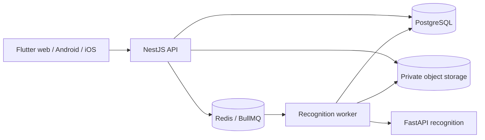

# Implementation Plan — Giai đoạn 0: Nền móng và cộng tác GitHub

Trạng thái: kế hoạch triển khai, chưa thực hiện. Cập nhật: 2026-09-07.

## 1. Mục tiêu và nguồn chuẩn

Đồng nghiệp phải clone repository trên máy mới, làm theo README, khởi động hạ tầng, áp dụng migration đã commit, chạy API và Flutter development, chạy các kiểm tra tương đương CI mà không cần nhận file bí mật từ tác giả.

Nguồn chuẩn: [AGENTS.md](AGENTS.md) và [tài liệu HTML](PHAN_TICH_THIET_KE_HE_THONG.html), đặc biệt §03–04 (UC), §07 (lớp thiết kế), §08 (dữ liệu), §09 (truy vết). Áp dụng thứ tự ưu tiên AGENTS.md §1. Nhãn Xanh trong HTML không cho phép máy tự ghi điểm chính thức; fake recognition chỉ dùng trong test hoặc cấu hình dev rõ ràng.

Hiện trạng khi sửa plan: workspace chỉ có AGENTS.md, tài liệu HTML và implementation_plan1.md; chưa có README, mã nguồn hoặc Git repository. Các file, lệnh và workflow dưới đây là đầu ra cần tạo, không phải chức năng đang tồn tại. Sửa plan không đồng nghĩa đã tạo repository GitHub.

## 2. Phạm vi và điều kiện hoàn thành

### 2.1 Trong Giai đoạn 0

- Workspace Flutter/Melos và NestJS/pnpm; Flutter có web, Android, iOS ngay từ đầu.
- Cấu hình development/staging/production; PostgreSQL, Redis, MinIO local.
- API nền móng: validation, error envelope, logging, request ID, liveness/readiness, OpenAPI.
- Baseline 16 bảng, migration, quyền DB, seed giả và integration test cho ràng buộc đã tạo.
- Sinh Dart client; Flutter gọi health qua client sinh tự động, có loading/error/retry.
- ADR kiến trúc, module ownership, ranh giới transaction và worker/FastAPI.
- Onboarding, GitHub issue/PR templates, CI và quy trình review/merge.

### 2.2 Chưa triển khai trong Giai đoạn 0

Đăng nhập thật, CRUD danh mục, nhập/duyệt/chốt điểm, OCR, tổng kết và Excel được bàn giao theo §12. Không đánh dấu UC hoàn thành chỉ vì có bảng hoặc module. Không thêm Kubernetes, multi-tenancy, huấn luyện mô hình, push notification hoặc tích hợp Vietschool trực tiếp.

Không cần tạo mọi thư mục rỗng trong AGENTS.md. Tuy nhiên, phần nào đã tạo schema hoặc hành vi thì phải có kiểm thử tương xứng ngay trong giai đoạn này.

## 3. Quyết định nền tảng và ADR

| Quyết định | Nội dung cần chốt | Đầu ra |
|---|---|---|
| Stack | Flutter, NestJS modular monolith, PostgreSQL/Prisma, Redis/BullMQ, MinIO, FastAPI | ADR-0001 và sơ đồ container |
| Toolchain | Phiên bản còn được hỗ trợ và tương thích; pin Node, pnpm, Flutter/Dart, Prisma, generator, images | docs/development/toolchain.md, cấu hình phiên bản, lockfile |
| Database | Tên DB tiếng Việt, quyền runtime, migration, rollback, kiểu dữ liệu | ADR-0002 và data dictionary |
| Contract | API là nguồn sinh OpenAPI; commit snapshot và Dart client; phát hiện drift | ADR-0003 |
| Transaction | Review dùng public application ports trong cùng Unit of Work | ADR-0004 và sequence diagram |

Trước PR nền móng, kiểm tra tài liệu chính thức về compatibility/support của công cụ rồi pin; không chọn phiên bản chỉ vì đang có trên máy một người. Lưu ngày kiểm tra và lý do chọn. Không tự nâng dependency trong CI. Dependency mới phải có lý do trong PR.

ADR gồm vấn đề, lựa chọn, đánh đổi, tác động bảo mật/dữ liệu, cách kiểm chứng và migration. Quyết định nghiệp vụ mới được chốt phải cập nhật ADR, acceptance criteria và AGENTS.md; không chỉ lưu trong chat.

## 4. Kiến trúc và cấu trúc workspace



API là một deployable nghiệp vụ. Worker là entrypoint riêng trong cùng backend codebase, dự kiến apps/api/src/worker.ts, triển khai ở Giai đoạn 3. FastAPI đặt tại apps/recognition-service/ theo AGENTS.md; Giai đoạn 0 xác định contract boundary, chưa chạy pipeline hoặc model giả trong production.

### 4.1 Ánh xạ HTML sang code

| HTML §07 | Vị trí triển khai |
|---|---|
| Boundary / màn hình | Flutter feature presentation |
| Control / điều phối use case | NestJS application use case, không phải HTTP controller |
| Entity / quy tắc nghiệp vụ | Domain không phụ thuộc framework/ORM |
| Nhận dạng, kho ảnh, Excel | Application ports và infrastructure adapters |

Mỗi module NestJS dùng domain/, application/, infrastructure/, presentation/, module.ts khi có nội dung. Controller chỉ xử lý HTTP/DTO và gọi use case. Infrastructure triển khai port; domain không import NestJS hoặc Prisma. common/ chỉ chứa kỹ thuật dùng chung.

### 4.2 Module ownership

| Module | Trách nhiệm / dữ liệu |
|---|---|
| identity | nguoi_dung, phiên, mật khẩu |
| authorization | RBAC/ABAC; dùng dữ liệu phân công qua public interface |
| academic-years | nam_hoc, hoc_ky |
| students | hoc_sinh, tra cứu theo tài khoản |
| classes | lop, danh sách lớp |
| subjects | mon_hoc, thanh_phan_diem |
| teachers | giao_vien, phan_cong_giang_day |
| gradebooks | bang_diem, diem_thanh_phan, khóa bảng và cập nhật ô |
| recognition | phieu_nhan_dien, ket_qua_dong, tu_dien_diem_chu, điều phối job |
| review | Điều phối duyệt, không sở hữu bản sao bảng điểm |
| final-results | ket_qua_tong_ket và bộ hệ số đã dùng |
| reports | Read interfaces cho thống kê/Excel |
| audit | lich_su_sua_diem, audit kỹ thuật |
| files | Metadata, object key, upload và truy cập ảnh |

Module chỉ import public service/port của nhau; không import repository nội bộ. Thêm lint/import checks để bắt vi phạm và import framework vào domain. Service/use case phải tự kiểm quyền kể cả khi gọi nội bộ.

ADR-0004 xác định transaction context không lộ Prisma qua public application ports. Review mở một Unit of Work; adapters của gradebooks/audit/recognition dùng cùng DB transaction, không tự mở transaction độc lập. Giai đoạn 4 phải kiểm quyền/version/trạng thái, ghi điểm, thêm lịch sử, đóng dấu duyệt, gán ma_diem và đổi trạng thái phiếu nguyên tử.

### 4.3 File và thư mục cần tạo

```text
.
├─ README.md / CONTRIBUTING.md / SECURITY.md
├─ .editorconfig / .gitattributes / .gitignore / .env.example
├─ package.json / pnpm-workspace.yaml / pnpm-lock.yaml
├─ pubspec.yaml / pubspec.lock / melos.yaml
├─ apps/
│  ├─ api/src/{common,modules}/
│  ├─ api/test/
│  └─ client_flutter/{lib,test,integration_test,web,android,ios}/
├─ packages/
│  ├─ api_client_dart/
│  ├─ design_system/
│  ├─ domain_models/
│  ├─ flutter_test_utils/
│  ├─ contracts/
│  ├─ config-eslint/
│  └─ config-typescript/
├─ database/{prisma,migrations,seeds,tests}/
├─ infrastructure/{compose.yaml,docker}/
├─ docs/{architecture,adr,api,database,security,ux,development}/
├─ scripts/
└─ .github/{workflows,ISSUE_TEMPLATE,PULL_REQUEST_TEMPLATE.md,CODEOWNERS}
```

Packages chỉ tạo khi có consumer cụ thể. pnpm workspace khai báo phạm vi TypeScript rõ ràng; nếu database là package tooling phải thêm vào workspace, không coi Flutter/FastAPI là Node package. Không đặt business rule server trong domain_models hoặc widget.

Chuẩn hóa UTF-8 và line endings bằng editorconfig/gitattributes, hỗ trợ Windows/macOS/Linux. Commit lockfiles, migrations, OpenAPI và generated client; ignore env secrets, caches, build, ảnh dữ liệu thật, model weights và IDE config cá nhân. Cho phép .env.example. Không commit secret hoặc PII.

## 5. Database: thiết kế trước migration

### 5.1 Data dictionary bắt buộc

Tạo docs/database/data-dictionary.md từ HTML §07–08. Từng cột phải có tên DB/code, kiểu, nullable/default, PK/FK/UQ/CHECK/index, on-delete/on-update và nguồn yêu cầu. Bảng dưới là checklist tối thiểu, không thay thế dictionary đầy đủ.

| Bảng | Dữ liệu và ràng buộc cần đặc tả |
|---|---|
| nguoi_dung | Username unique, password hash, vai trò, trạng thái, khóa tạm |
| giao_vien | PK đồng thời FK nguoi_dung theo HTML; quan hệ 1:1 |
| hoc_sinh | FK lớp; tài khoản nullable và unique khi được gán để một tài khoản không trỏ nhiều học sinh |
| nam_hoc | Ngày bắt đầu/kết thúc; cách bảo đảm chỉ một năm hiện hành, không dùng CHECK phụ thuộc đồng hồ |
| hoc_ky | FK năm học, UQ(năm học, thứ tự), khoảng ngày hợp lệ |
| lop | FK năm học/giáo viên chủ nhiệm; UQ(năm học, tên lớp) |
| mon_hoc | Tên môn unique |
| thanh_phan_diem | FK môn, numeric(3,2) hệ số, bắt buộc, thứ tự hiển thị; miền hệ số và kiểm tổng hợp |
| phan_cong_giang_day | FK giáo viên/lớp/môn/học kỳ; UQ(lớp, môn, học kỳ) |
| bang_diem | UQ(lớp, môn, học kỳ), trạng thái, version phục vụ concurrency |
| diem_thanh_phan | UQ(bảng, học sinh, thành phần); numeric(3,1) NULL, không default 0; trạng thái và nguồn nhập |
| lich_su_sua_diem | FK điểm/người sửa, giá trị cũ/mới, lý do, thời điểm; append-only ở DB |
| ket_qua_tong_ket | UQ(học sinh, môn, học kỳ); điểm, xếp loại, ngày tính, phiên bản và snapshot hệ số đủ giải thích kết quả cũ |
| phieu_nhan_dien | FK bảng/thành phần/người tải; SHA-256 unique, object key ảnh gốc, số dòng khai báo/phát hiện, trạng thái, lỗi, version |
| ket_qua_dong | UQ(phiếu, thứ tự), FK học sinh; ma_diem nullable FK điểm chỉ gán khi duyệt; hai object key ảnh ô; raw output/giá trị/confidence từng kênh; kết luận, màu, giá trị chốt, người/thời điểm duyệt |
| tu_dien_diem_chu | Cách đọc unique, giá trị chuẩn hóa trong miền điểm |

Giữ đúng bảy enum và giá trị trong AGENTS.md §6. Timestamps dùng timestamptz/UTC; ngày sinh và ngày lịch thuần dùng date. Điểm dùng Decimal, không dùng float cho tính/lưu nghiệp vụ. API phải quy định cách biểu diễn Decimal/bigint để client không mất chính xác.

Snapshot hệ số là bổ sung để thực hiện yêu cầu giải thích kết quả cũ; định nghĩa format/version trong ADR, không chỉ lưu nhãn trỏ tới hệ số có thể bị sửa. Không chốt công thức làm tròn/xếp loại trong seed.

DB kiểm miền 0.0–10.0. API phải từ chối đầu vào sai bước 0.1 trước khi ép numeric(3,1), có test 8.55. CHECK trên giá trị đã ép numeric(3,1) không chứng minh đầu vào gốc hợp lệ vì có thể đã bị làm tròn. Trước migration phải chọn write interface DB có kiểm tra trước ép kiểu và quyền chặn ghi trực tiếp nếu cần DB từ chối cả SQL đầu vào quá scale; ghi rõ cơ chế và kiểm thử, không coi CHECK khoảng điểm là đã giải quyết toàn bộ bất biến.

Đặc tả kiểm tra liên bảng: học sinh thuộc lớp bảng điểm; thành phần thuộc môn; lớp/học kỳ cùng năm; điểm gán khi duyệt đúng học sinh/bảng/thành phần của phiếu. Ghi mỗi quy tắc được bảo vệ bằng composite FK hay application transaction. FK đơn lẻ không bảo đảm tính nhất quán này. Lịch sử chuyển lớp vẫn là quyết định mở trước production.

Không cascade-delete điểm/lịch sử/phiếu/kết quả đã dùng. Chọn RESTRICT/NO ACTION và trạng thái theo vòng đời. Object keys lưu với mapping tên cột tiếng Việt đã chốt; không lưu signed URL lâu dài hoặc binary ảnh trong PostgreSQL.

### 5.2 Roles, migration và seed

- Tách migration role và runtime role. API không dùng owner/superuser, không có DDL. Audit runtime chỉ được SELECT/INSERT khi cần, không UPDATE/DELETE/TRUNCATE.
- Integration tests dùng runtime role để chứng minh bảo vệ. Giai đoạn 3 thêm worker role chỉ ghi nhận dạng/job, không ghi điểm chính thức hoặc lịch sử duyệt.
- Baseline gồm schema, SQL constraints/indexes, quyền và hướng khôi phục. Bảng kỹ thuật bổ sung được phân biệt với 16 bảng nghiệp vụ.
- Xác minh vị trí migration tương thích Prisma đã pin. Mục tiêu database/migrations/ theo AGENTS.md; nếu công cụ yêu cầu khác, ghi ADR và chỉ giữ một nguồn SQL. Root scripts luôn chỉ rõ schema/config.
- Tác giả tạo migration local; CI/đồng nghiệp áp dụng migration đã commit. Không dùng db push hoặc tạo migration mới khi onboarding.
- Migration đã chạy ở môi trường chung không được sửa/xóa/đổi tên. Mỗi thay đổi có rollback hoặc giải thích không thể rollback kèm phương án backup/restore.
- Schema PR cập nhật dictionary, tests, generation và contract nếu bị ảnh hưởng. Chạy từ DB rỗng và upgrade từ migration main gần nhất; baseline đầu tiên ghi rõ không có bản trước.
- Seed idempotent, guard chỉ development/test. Dữ liệu giả đủ FK, gồm admin, hai giáo viên khác phân công, hai học sinh khác tài khoản, danh mục và từ điển mẫu. Password lấy qua env, băm Argon2id; không in secret, không tạo tài khoản production mặc định, không reset mật khẩu hoặc ghi đè dữ liệu hiện hữu âm thầm.

## 6. Hạ tầng và môi trường

Compose có PostgreSQL, Redis, MinIO, bước init bucket private chạy lại an toàn, healthcheck và startup timeout. Pin images. Port mặc định 5432/6379/9000/9001, API 3000; override qua env, published ports local bind loopback. Tách host URL/container hostname; README hướng dẫn Android emulator/device không dùng localhost của máy tính.

Volume development được giữ khi down. Cleanup test chỉ xóa tài nguyên thuộc project/run test đã xác định; không tự xóa volume development.

.env.example chỉ chứa placeholder và giải thích. Script tạo env local không ghi đè file đã có, không cố định mật khẩu chung. Server fail-fast khi env thiếu/sai; không mặc định runtime dùng postgres superuser.

Env server gồm DB role URLs, Redis, object storage, allowed origins, log level/timeouts. Client chỉ chứa endpoint/thông tin công khai; không nhúng secret trong Dart/web build. Có cấu hình development/staging/production riêng; cấu hình production không lấy fallback development âm thầm.

CORS dùng allowlist, không wildcard với credentials. Giai đoạn 1 triển khai web session HttpOnly/Secure/SameSite + CSRF và secure storage mobile. MinIO private được test anonymous denied; MIME/size/pixel, signed URL và upload triển khai Giai đoạn 3.

## 7. API, OpenAPI và Flutter

### 7.1 API nền móng

- Prefix /api/v1. Success trả DTO trực tiếp; chưa thêm global response wrapper. Danh sách lớn sau này dùng DTO items/nextCursor, binary export có contract riêng.
- Error envelope code/message/details/requestId nhất quán cho validation/not-found/internal/dependency errors. Không lộ stack/SQL/secrets/PII.
- Request ID trên response header/log, kể cả lỗi trước controller; validate độ dài/định dạng correlation ID do client gửi. Logging có redaction, không ghi request/response chứa điểm đầy đủ hoặc ảnh.
- /api/v1/health/live phản ánh process; /api/v1/health/ready kiểm PostgreSQL/Redis/MinIO với timeout, trả 503 khi thiếu dependency bắt buộc. Không lộ connection details.
- Không expose endpoint nghiệp vụ chưa có auth. Giai đoạn 1 thêm bảo vệ mặc định, explicit public routes và kiểm quyền ở use case.

### 7.2 Contract generation

OpenAPI snapshot tại docs/api/openapi.json, Swagger development tại /api/docs. Export chạy được không cần production secret hoặc OCR. Pin generator/config; sinh packages/api_client_dart từ snapshot và commit kết quả. Cấm sửa tay generated code; custom network/session adapter đặt bên ngoài.

CI tái sinh OpenAPI/client và fail khi có diff chưa commit. Kiểm nullable, enums, errors, operationId, Decimal/bigint qua generation/analyze và test serialization phù hợp. API thay đổi phải cập nhật snapshot/client/tests/docs cùng PR. Breaking change cần phương án tương thích hoặc version mới, không đổi âm thầm.

### 7.3 Flutter

Dựng ba target, Melos, Material 3, Riverpod, GoRouter, cấu hình ba môi trường. Luồng nền móng gọi health bằng generated client, có loading/success/error/retry và timeout; không gọi Dio trực tiếp từ widget. Đây là kiểm tra kết nối, không thay màn hình nghiệp vụ.

Chạy format/analyze/unit/widget, kiểm web ở hai kích thước và Android emulator. iOS cần macOS/Xcode: phân công runner/máy đồng nghiệp để build và simulator smoke. Build không thay runtime test; nếu chưa có máy, ghi blocked và không tuyên bố hoàn tất đa nền tảng.

## 8. Cộng tác GitHub

### 8.1 Khởi tạo và quyền truy cập

Trước publish cần owner/organization, URL repository, visibility và license do chủ dự án quyết định. Trong lúc chưa có vẫn hoàn thành được local scaffolding. Không tự chọn tài khoản tổ chức hoặc public visibility. Rà secret/PII trước initial commit; main là nhánh mặc định.

Maintainer cấu hình yêu cầu PR, ít nhất một reviewer khác tác giả, required checks xanh trên bản mới nhất, giải quyết review conversations, chặn force-push/xóa main. Khả năng enforce phụ thuộc cấu hình repository; kiểm tra thực tế và lưu bằng chứng, không coi có workflow YAML là đã bật bảo vệ nhánh. Nếu chưa enforce được, ghi giới hạn và reviewer chịu trách nhiệm thủ công.

CODEOWNERS chỉ dùng handles/team thực đã xác nhận. Phân công review database, API/contracts, Flutter, CI/security; nhóm nhỏ có thể kiêm nhiệm nhưng tác giả không tự thay người duyệt độc lập.

### 8.2 Quy trình issue → PR → merge

1. Issue ghi UC/bất biến, scope, acceptance criteria, owner, dependency và phần không làm.
2. Nhánh ngắn từ main mới nhất: feat/<issue>-<slug>, fix/..., docs/... hoặc chore/....
3. Giữ PR có phạm vi nhỏ, review được. Thống nhất interface trước khi nhiều người đổi schema/contract/package chung.
4. Mở draft PR sớm; bổ sung migration/contract/client/UI/tests/docs trong cùng lát cắt khi cần.
5. Chạy kiểm tra local, cập nhật với main, resolve conflicts, chạy lại phần bị ảnh hưởng. Không force-push nhánh người khác cùng dùng khi chưa phối hợp.
6. Reviewer kiểm hành vi, quyền, transaction, SQL và CI. Squash merge mặc định, PR liên kết issue và giữ quyết định thiết kế quan trọng.

PR template: vấn đề/hành vi mới, UC/bất biến, lệnh và kết quả test, migration/API diff, rollback, ảnh UI nếu có, giới hạn chưa kiểm chứng, lý do dependency mới.

Hai nhánh cùng đổi schema phải phối hợp thứ tự merge; nhánh sau rebase và kiểm toàn bộ chuỗi migration. Chỉ tạo lại migration chưa áp dụng ở môi trường chung. Không sửa migration đã chia sẻ để giải conflict. Lockfile/generated client conflict được tái sinh từ nguồn đã merge, không chọn mù một phía.

### 8.3 Tài liệu và template

| File | Nội dung |
|---|---|
| README.md | Prerequisites, sơ đồ, setup/chạy/test từ root, lỗi thường gặp |
| CONTRIBUTING.md | Nhánh, issue/PR, review, migration, generation, quy tắc commit |
| SECURITY.md | Kênh báo bảo mật đã thống nhất; không đăng token/PII trong issue |
| .github/ISSUE_TEMPLATE/ | Bug và feature/task có acceptance criteria |
| .github/PULL_REQUEST_TEMPLATE.md | Checklist theo rủi ro |
| .github/CODEOWNERS | Reviewer thực theo phạm vi |
| docs/development/onboarding.md | Windows/macOS/Linux, checklist máy mới |

Không đưa dump DB thật, ảnh học sinh, secrets, model weights vào Git. CI secrets ở secret store. PR không tin cậy chạy quyền read-only, không được nhận deploy secrets. Giai đoạn 0 không tự động deploy production.

## 9. Lệnh dùng chung và CI

### 9.1 Root scripts cần triển khai

Đây là giao diện lệnh dự kiến, chưa chạy được ở workspace hiện tại. Tất cả chạy từ root, không dùng chuỗi cd phụ thuộc đường dẫn trước đó. Hỗ trợ PowerShell và CI Linux hoặc có wrapper được ghi rõ.

| Lệnh | Trách nhiệm |
|---|---|
| pnpm setup:local | Kiểm prerequisites, tạo env nếu chưa có, không overwrite |
| pnpm infra:up | Compose up và chờ healthy có timeout |
| pnpm infra:down | Dừng, giữ volume dev |
| pnpm db:generate | Sinh Prisma client đã pin |
| pnpm db:migrate | Áp dụng migration đã commit, schema/config rõ ràng |
| pnpm db:migrate:create | Tạo migration local có tên, cần rà SQL |
| pnpm db:seed | Seed idempotent, guard dev/test |
| pnpm dev:api | Chạy API development |
| pnpm api:export | Sinh OpenAPI deterministic |
| pnpm client:generate | Sinh Dart client từ snapshot |
| pnpm contracts:check | Tái sinh, phát hiện drift |
| pnpm check | Format check, lint, typecheck, unit, build backend |
| pnpm test:db | PostgreSQL thật, runtime roles, DB test riêng |
| pnpm test:integration | API và dependencies thật, stack cô lập |
| dart run melos bootstrap | Resolve Dart workspace theo toolchain/lockfile |
| dart run melos run check | Format check, analyze, unit/widget |
| dart run melos run dev:web | Chạy web development từ config công khai |

README phải kiểm chứng thứ tự: cài toolchain → install theo lockfile → setup env → infra up → generate/migrate/seed → API → export/generate client → Dart bootstrap → Flutter. CI dùng frozen/locked resolution phù hợp công cụ, không tự cập nhật dependencies.

### 9.2 Jobs bắt buộc

| Job | Điều kiện pass |
|---|---|
| backend | Format/lint/typecheck/unit/build, import boundaries |
| database | Migration từ rỗng, upgrade từ main gần nhất, constraints/permissions |
| integration | PostgreSQL/Redis/MinIO thật; health/readiness/error/private bucket |
| contracts | Regenerate không diff, generated Dart analyze/serialization |
| flutter | Analyze/unit/widget, build web/Android; iOS trên macOS |
| platform-smoke | Web/Android/iOS success/error/retry, ghi profile và bằng chứng |
| repository | Scan secret, kiểm links/config cần thiết |
| required-checks | Tổng hợp jobs; không pass khi job cần thiết skip/fail |

Pin GitHub Actions theo commit SHA được review; timeout/concurrency/cleanup rõ ràng. Không dùng production DB trong tests, không để env/PII trong logs/artifacts. Không chạy untrusted PR code với quyền cao qua pull_request_target. Ưu tiên chạy toàn bộ checks Giai đoạn 0; nếu thêm path filters phải tránh bỏ sót ảnh hưởng schema/contract hoặc làm required checks treo. Không xóa test để làm CI xanh.

## 10. Thứ tự đầu việc và acceptance criteria

Mỗi ID thành issue/PR có owner thực khi triển khai. Dependency là điều kiện tích hợp; các thành viên có thể làm phần độc lập sau khi thống nhất interface.

| ID | Đầu ra | Dependency | Nghiệm thu |
|---|---|---|---|
| P0-01 | ADR, toolchain, workspace, Git templates, docs | Không | Pin và install từ root; review rules rõ; baseline CI khi package có mặt |
| P0-02 | Compose, env validation, scripts dev/test | P0-01 | Healthy, thiếu env fail rõ, bucket private, down giữ dữ liệu |
| P0-03 | Dictionary, schema, SQL migration/roles/seed | P0-01–02 | 16 bảng/enum đúng; constraints/quyền/seed lặp pass; rollback có tài liệu |
| P0-04 | API skeleton, boundaries, logging/errors/health | P0-01–03 | Không endpoint nghiệp vụ bỏ auth; ready 503 khi lỗi; request ID thống nhất |
| P0-05 | OpenAPI/generator/Dart client | P0-04 | Regenerate sạch, nullable/error/enum/serialization đúng |
| P0-06 | Flutter ba target và môi trường | P0-01, P0-05 | Loading/success/error/retry, responsive, smoke ba nền tảng |
| P0-07 | CI đầy đủ, truy vết, onboarding, GitHub settings | P0-01–06 | Checks pass; đồng nghiệp clone/setup; bảo vệ nhánh được xác minh |

Migration baseline đầu tiên ghi upgrade N/A có lý do; từ migration sau phải test upgrade. Trước có remote chạy checks local; sau có repository phải xác minh lại GitHub Actions. Không đánh dấu GitHub gate xong bằng kết quả local.

## 11. Ma trận kiểm chứng Giai đoạn 0

| Yêu cầu | Bằng chứng |
|---|---|
| NULL khác 0.0 | Ghi/đọc hai giá trị bằng runtime role và assert khác |
| Miền điểm/UQ/FK | Reject ngoài khoảng, FK sai, trùng bảng/ô/phân công/checksum/thứ tự dòng |
| Scale điểm | Kiểm write interface trước numeric coercion, có ca 8.55 |
| Append-only | SELECT/INSERT hợp lệ; UPDATE/DELETE/TRUNCATE lịch sử bị từ chối bằng runtime role |
| Liên kết nhận dạng | ma_diem NULL hợp lệ, FK sai bị từ chối; kiểm chỉ gán khi duyệt ở Giai đoạn 4 |
| Không mất lịch sử | Xóa parent dữ liệu được bảo vệ bị từ chối, không cascade |
| Env/storage | Thiếu env fail-fast, anonymous bucket access denied, không log secret |
| API | live 200, ready 503 khi dependency lỗi, envelope 400/404/500 đúng |
| Contract | Regenerate sạch, Dart analyze/serialization và gọi health pass |
| Flutter | Widget + smoke web/Android/iOS, trạng thái lỗi/retry |
| Cộng tác | Clone mới theo README, PR checks và reviewer policy được xác minh |

Không mock DB để thay integration test nghiệp vụ/ràng buộc. Không coi server khởi động và mở Swagger là đủ nghiệm thu.

## 12. Truy vết và bàn giao giai đoạn sau

Tạo docs/architecture/traceability.md: UC/bất biến → module → bảng → issue/PR → test → trạng thái. Kế thừa HTML §09, không sao chép trạng thái hồ sơ thiết kế thành trạng thái phần mềm.

| Giai đoạn | UC/phạm vi | Gate nghiệp vụ và kiểm thử |
|---|---|---|
| 1 | UC01–08, tài khoản/danh mục | Session/rotation hoặc tương đương, CSRF, Argon2id/rate-limit/audit, IDOR giáo viên/học sinh, contract/client/UI đồng bộ |
| 2 | UC09–10, điểm/lịch sử | Nhập tay đúng quyền/lý do/audit; NULL/0; khóa bảng; transaction/concurrency trên PostgreSQL thật |
| 3 | UC11–12, upload/nhận dạng | 202/jobId; polling/SSE; chống trùng SHA-256; retry hữu hạn/idempotent; MIME/size/pixel; lệch lưới dừng; blank trước model; hai kênh; timeout/malformed/model unavailable; không ghi điểm chính thức |
| 4 | UC13, đối chiếu/duyệt | Ảnh ô + hai kênh/confidence, ưu tiên Vàng/Đỏ; transaction nguyên tử, rollback giữa chừng, duyệt/chốt đồng thời, idempotency, IDOR |
| 5 | UC14–18, tổng kết/báo cáo/cá nhân | Chỉ DA_DUYET, snapshot/version hệ số, quy tắc tính đã chốt, export dữ liệu hợp lệ, học sinh chỉ đọc mình |
| 6 | Hardening/phát hành | Backup/restore, tải, bảo mật, runbook, web routing, Android internal testing, iOS signing/TestFlight |

Giai đoạn 3 phải đóng khoảng trống DB commit/enqueue bằng transactional outbox hoặc cơ chế bền vững tương đương. Worker retry không tạo dòng lặp và không ghi điểm chính thức. Upload/approve idempotency phải lưu phạm vi actor/operation, request hash và kết quả; cùng key khác payload phải reject. Các quyết định này có ADR trước khi triển khai, không chỉ thêm dependency BullMQ rồi coi đã có bảo đảm.

## 13. Quyết định còn mở và rủi ro

| Vấn đề | Deadline | Cách tiếp tục |
|---|---|---|
| GitHub owner/URL, visibility, handles, license | Trước publish/P0-07 | Hoàn thành local; không giả định đã có quyền hoặc branch protection |
| Toolchain và macOS runner | P0-01/P0-06 | Kiểm compatibility, pin, phân công iOS |
| Vị trí migration Prisma | Trước P0-03 | Spike và ADR; một nguồn SQL |
| DB từ chối đầu vào quá scale | Trước P0-03 | Chốt write interface/quyền/test trước coercion |
| Làm tròn/xếp loại/thiếu điểm | Trước tổng kết production | Không hard-code thành quy tắc cuối; cập nhật ADR/AGENTS/AC |
| Confidence/model version | Trước OCR production | Cấu hình có version và bằng chứng hiệu chỉnh |
| Excel/Vietschool | Trước nghiệm thu export thực tế | Mẫu dev giả có nhãn rõ |
| Retention, SLA, vùng dữ liệu, quy mô | Trước production | Chính sách được xác nhận và runbook |
| Duyệt nhiều cấp/chuyển lớp lịch sử | Trước nghiệp vụ liên quan/production | Không tự mở rộng vai trò hoặc mô hình |

## 14. Definition of Done

- [ ] P0-01–07 có issue/PR, owner và bằng chứng acceptance criteria.
- [ ] Module ownership/ADR thống nhất AGENTS.md và HTML.
- [ ] Đồng nghiệp setup từ clone mới; lệnh README đã chạy thực tế.
- [ ] Schema/constraints/roles/migration/seed được kiểm chứng trên DB thật.
- [ ] Runtime không dùng DB owner; API/config/logging không lộ secret.
- [ ] OpenAPI và Dart client tái sinh sạch, không drift.
- [ ] Flutter ba nền tảng có bằng chứng kiểm tra; build không thay runtime test.
- [ ] CI pass thực tế; branch protection/review policy được xác minh, giới hạn được ghi rõ.
- [ ] Không secret/PII/ảnh thật trong Git, logs, artifacts.
- [ ] Truy vết, rollback, onboarding và backlog giai đoạn sau cập nhật.

Chỉ đánh dấu khi có bằng chứng. Báo cáo mỗi PR ghi file/hành vi thay đổi, lệnh thực chạy, kết quả và phần còn bị chặn; không dùng kết quả dự kiến thay kết quả test.
